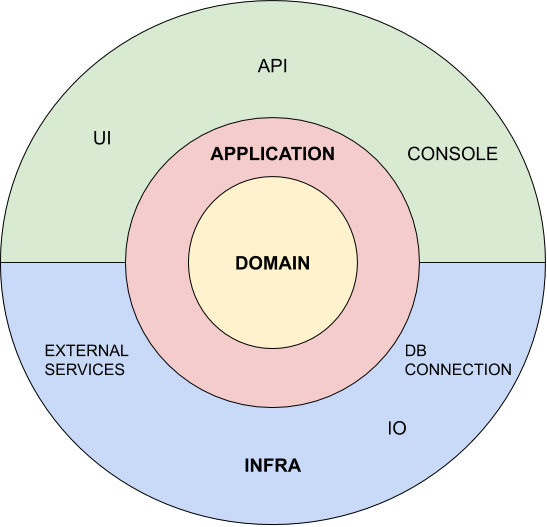

# Clean Architecture Generator

CleanArchGen is a tool to generate a scaffolding .Net Core project based on the Clean Architecture style

[The Clean Architecture](https://blog.cleancoder.com/uncle-bob/2012/08/13/the-clean-architecture.html) - *Uncle Bob*

Tired to run dotnet command or use plugins to scaffold projects? CleanArchGen will help you, see how in the Features section below.

CleanArchGen will deliver an application running in the following architecture :



This architecture was inspired on Herberto Graca [article](https://herbertograca.com/2017/11/16/explicit-architecture-01-ddd-hexagonal-onion-clean-cqrs-how-i-put-it-all-together/), where I found this beautiful image:


## Features

    - Create solution file
    - Create src folder
    - Create Domain layer
    - Create Application layer
    - Create Infra layer
    - Create Api or Console layer
    - Add projects on solution
    - Reference projects
        - Application -> Domain
        - Infra -> Application
        - Infra -> Domain
        - Api or Console -> Application
        - Api or Console -> Domain
        - Api or Console -> Infra
    - Create tests folder
    - Create test pyramid folder
        - Create UnitTests project
        - Create IntegrationTests project
        - Create FunctionalTests project
        - Reference project into test projects
    - Create .gitignore file
    - Create README.md file
    - Build project

## Getting Started

TBD

### Prerequisites

.NET Core 3.1

### Installing

TBD

## Running the tests

Run command on the solution file (.sln) folder :

```
dotnet test
```

## Running the mutation tests

If you don't have dotnet-stryker installed, go to the root of the project and run 
```
dotnet tool restore
```

On tests/CleanArchGen.UnitTests run 
```
dotnet stryker --project-file=[projectfile]
```

## Deployment

TBD

## Built With

* [.NET Core](https://dotnet.microsoft.com/download) - *Software Developmet Kit (SDK)*
* [Visual Studio Code](https://code.visualstudio.com/) - *Integrated Development Environment (IDE)*
* [xUnit.net](https://xunit.net/) - *Unit Test Framework*
* [Fluent Assertions](https://fluentassertions.com/) - *Unit Test Assertions Extension Methods*
* [Moq](https://github.com/moq/moq4) - *The most popular mocking library for .NET*

## Versioning

TBD

## Authors

* **Vinicius Pfeifer**

See also the list of [contributors](https://github.com/vpfeifer/clean-arch-generator/graphs/contributors) who participated in this project.

## License

TBD
